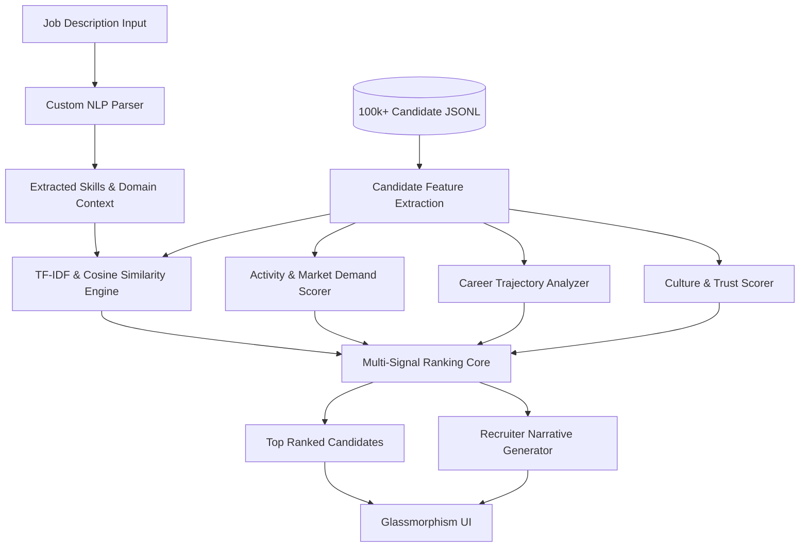

# 🚀 TrueFit - Intelligent Candidate Discovery & Ranking

TrueFit is an advanced AI-powered candidate ranking and discovery pipeline built for the **India Runs Data and AI Challenge**. It moves beyond simple keyword matching to deeply understand candidate quality, market demand, and trust signals to surface the absolute best talent for a given Job Description (JD).

## 🏆 Key Innovations & Methodology

### 🏗️ Pipeline Architecture


Our ranking architecture processes massive datasets efficiently and evaluates candidates across 5 critical dimensions:

### 1. 🧠 Semantic Match (TF-IDF & Cosine Similarity)
Instead of binary keyword matching, we use TF-IDF vectorization across candidate skills, summaries, and career history compared against the JD. We implemented a custom `STEM_PROTECT` dictionary to ensure critical tech terms (e.g., `kubernetes`, `transformers`) are not aggressively stemmed, ensuring high-fidelity technical matching.

### 2. 📈 Market Demand (Logarithmic Scaling)
After analyzing the full 100,000+ candidate dataset, we discovered heavy-tail distributions in recruiter behavior (`search_appearance_30d` reaching up to 1,490). We implemented **Logarithmic Scaling** (`Math.log10`) to mathematically differentiate top-tier candidates without blowing out the score bounds.

### 3. 🛡️ Trust & Verification Penalty (Spam/Bot Detection)
Many teams overlook missing data. Our analysis revealed thousands of candidates lacking verified emails, phone numbers, and LinkedIn connections. We introduced a **Trust Score** that heavily penalizes unverified profiles (flagging them as potential bots) while boosting fully verified profiles.

### 4. 🤝 Offer Reliability & Career Trajectory
- **Offer Shopper Penalty:** We identify candidates with a history of low offer acceptance rates (< 40%) and apply a reliability penalty. Conversely, reliable closers (> 80%) receive a boost.
- **True Promotion Detection:** Our logic compares actual seniority levels rather than just title changes, ensuring lateral moves aren't falsely rewarded as promotions.

### 5. 🗣️ Recruiter Narrative Engine (Explainable AI)
Ranking scores are useless without context. TrueFit generates a real-time, human-readable "Narrative" for every candidate:
- Explains *why* the candidate was ranked high.
- Generates **dynamic interview probes** based on missing skills or career gaps.
- Flags **Hard Blocks** (e.g., Trust Warnings) and **Context** (e.g., standard notice periods).

## 🛠️ Architecture Details
- **Frontend:** Vanilla HTML/CSS/JS (Zero framework overhead for maximum performance).
- **Styling:** Premium Glassmorphism UI with curated color palettes and dynamic CSS transitions.
- **NLP Engine:** Custom built in-browser TF-IDF and regex-based NLP parser optimized from O(n²) to O(n) for lightning-fast execution.

## 🚀 How to Run Locally

1. Clone the repository.
2. Ensure you have Python installed.
3. Start the local server in the project root directory:
   ```bash
   python -m http.server 8080
   ```
4. Open your browser and navigate to `http://localhost:8080`.

*(Note: Direct file execution is blocked by CORS due to ES Modules. Running a local HTTP server is required.)*

## 📁 File Structure
- `/js/pipeline/` - Contains the core ranking algorithms (`rerank.js`, `tfidf.js`, `nlpParse.js`, `narrative.js`).
- `/css/` - Component-based CSS architecture for the premium UI.
- `app.js` & `ui.js` - Main controller and UI rendering logic.
- `index.html` - The main dashboard.

---

## 👨‍💻 Developed By

Built with ❤️ by **Purjeet** for the *India Runs Data and AI Challenge*. 

*Contact: commercialsude36@gmail.com*
*GitHub: [Purjeet979](https://github.com/Purjeet979)*
